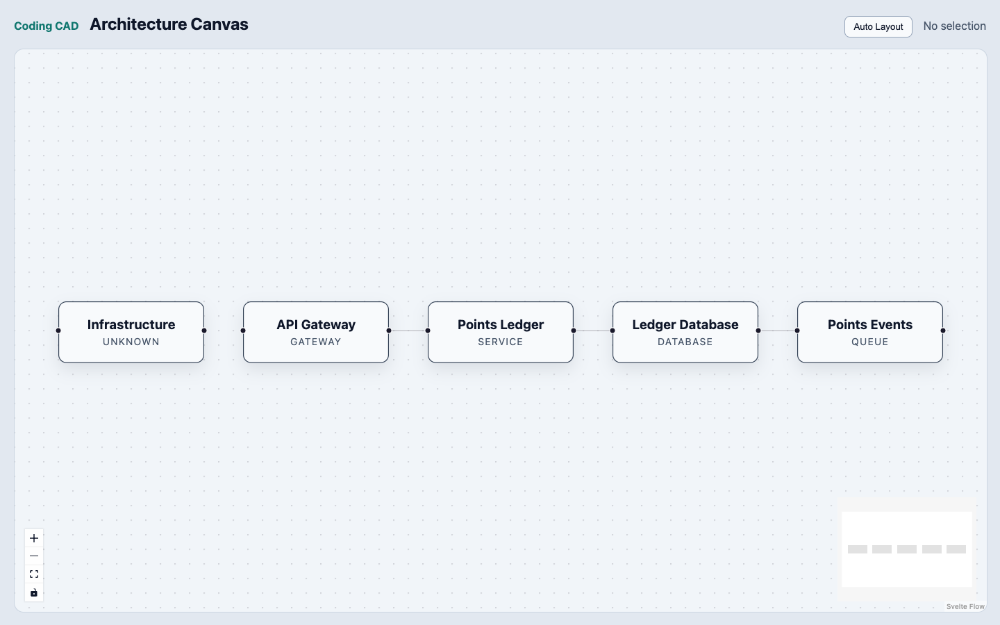

# Web App / Web 应用

该应用是 SvelteKit Architecture Workspace UI，是 Architecture IR 与 LayoutResult 的产品交互层。

This app is the SvelteKit Architecture Workspace UI, the product interaction layer over Architecture IR and LayoutResult.



第一版 UI 渲染和编辑 Architecture IR，而不是直接生成代码。Phase 2 使用 Svelte Flow 作为 Architecture IR 与 LayoutResult 的可替换交互视图。

D-009 已批准 Svelte Flow 作为 Architecture IR 与 LayoutResult 之上的可替换 V1 交互视图。

The first UI renders and edits Architecture IR rather than generating code directly. Phase 2 implements Svelte Flow as the replaceable V1 interactive view over Architecture IR and LayoutResult under D-009.

```text
ArchitectureProject
  -> @coding-cad/architecture-layout
  -> LayoutResult
  -> apps/web layout adapter
  -> Svelte Flow
  -> Architecture Canvas
```

UI 不能成为新的 Architecture Source of Truth。Svelte Flow state 不能代替 ArchitectureProject；选择、viewport、坐标和展开状态属于 View State，架构语义变更必须通过 commands、Validator 和 Review。

The UI must not become a new Architecture Source of Truth. Svelte Flow state cannot replace ArchitectureProject; selection, viewport, coordinates, and expansion belong to View State, while architecture-semantic changes must pass through commands, Validators, and Review.

## Phase 2 基础设施 / Phase 2 Infrastructure

`apps/web` 已原地初始化为 SvelteKit/Svelte 5 应用，并保留 `src/lib` 下的 Architecture、CAD、Layout adapter 与 Terminal TODO 所有权。当前实现包含真实 IR fixture、基础 Canvas、Standard + Semantic Zoom、pan/zoom/select、Workspace-owned drag position、Auto Layout reset、solver-only Web Worker 和 headless Add/Remove/Connect command application。

`apps/web` is initialized in place as a SvelteKit/Svelte 5 application while preserving Architecture, CAD, Layout adapter, and Terminal TODO ownership under `src/lib`. The current implementation includes a real IR fixture, foundational Canvas, Standard + Semantic Zoom, pan/zoom/select, Workspace-owned drag positions, Auto Layout reset, a solver-only Web Worker, and a headless Add/Remove/Connect command application.

`@xyflow/svelte` 的 import 与类型只能出现在 Canvas component、`src/lib/layout/adapters` 及其 app-layer test 中，不得泄漏到 command、持久化格式或任何 package public API。手动拖动只把 position 持久化到 Workspace-owned LayoutState，不得推导 constraint；node renderer 使用 Standard density，并在 semantic zoom 远景退化为 Compact。

`@xyflow/svelte` imports and types are restricted to Canvas components, `src/lib/layout/adapters`, and their app-layer tests. They must not leak into commands, persistence formats, or any package public API. Manual drag persists only position in Workspace-owned LayoutState and must not infer constraints; node rendering uses Standard density with a Compact semantic-zoom fallback.

## UI MVP Roadmap / UI MVP 路线图

### Architecture Workspace / 架构工作区

- Architecture Canvas / 架构画布
- Component Palette / 组件面板
- Property Inspector / 属性检查器
- Architecture Review / 架构审核
- Ghost Architecture Suggestions / 架构建议预览
- Problems / Validation / 问题与校验
- Execution Blueprint / Handoff / 执行蓝图与交接

Canvas 是产品第一公民。Svelte Flow 只负责 node/edge rendering、selection、viewport、pan、zoom 和 connection interaction，不负责 Architecture model、reasoning、validation 或 semantic layout。

The Canvas is a first-class product surface. Svelte Flow owns only node/edge rendering, selection, viewport, pan, zoom, and connection interaction, not the Architecture model, reasoning, validation, or semantic layout.

Inspector 以 Component semantics、Contracts、Constraints、Decisions、Dependencies、Implementation status 和 Validation issues 为主，不是 width/height/color/border 属性面板。

The Inspector centers on Component semantics, Contracts, Constraints, Decisions, Dependencies, Implementation status, and Validation issues; it is not a width/height/color/border property panel.

### Repository Workflow / 仓库工作流

- 打开本地仓库 / Open a local repository
- 导入并分析仓库 / Import and analyze a repository
- 展示反演后的 Architecture IR / Show reconstructed Architecture IR
- 展示架构合规状态 / Show architecture compliance status

### Integrated Terminal Infrastructure / 集成终端基础设施

- xterm.js 或同类终端视图 / xterm.js or an equivalent terminal view
- 由 server 或 desktop host 提供 PTY bridge / PTY bridge provided by a server or desktop host
- 多标签页和多终端会话 / Multiple tabs and terminal sessions
- 记录 session cwd、pid、status 和 exit status / Track session cwd, pid, status, and exit status
- 默认 cwd 绑定当前 Coding CAD Workspace 的代码仓库 / Bind the default cwd to the current Coding CAD Workspace repository
- 允许用户运行 `codex`、`claude`、`opencode` 或任意 shell 命令 / Let users run `codex`, `claude`, `opencode`, or arbitrary shell commands

终端只管理操作系统进程和 PTY。Coding Agent 始终由用户管理；这里不实现 Agent Provider、Agent Runtime、Agent SDK 调用或调度器。本阶段只记录路线图，不实现终端。

The terminal manages only operating-system processes and PTYs. Coding Agents remain user-managed; this layer does not implement Agent Providers, an Agent Runtime, Agent SDK invocation, or a scheduler. This phase records the roadmap only and does not implement the terminal.

## 测试计划 / Test Plan

Phase 2 已建立 Vitest、Svelte component tests 与 Playwright，并覆盖 adapter、command、state ownership、worker transport 和 Canvas smoke E2E。Greenfield、Brownfield、Inspector、Ghost accept/reject、Review 与 Blueprint handoff 仍按后续 Checkpoint 添加。

Phase 2 establishes Vitest, Svelte component tests, and Playwright for adapter, command, state-ownership, worker-transport, and Canvas smoke E2E coverage. Greenfield, Brownfield, Inspector, Ghost accept/reject, Review, and Blueprint handoff tests remain scoped to later Checkpoints.

## 详细文档 / Detailed Documentation

- [UI Architecture](../../docs/ui-architecture.md)
- [Architecture Layout Design](../../docs/architecture-layout.md)
- [Decision Required](../../docs/architecture-layout-decisions.md)
- [UI MVP Roadmap](../../docs/ui-mvp-roadmap.md)
